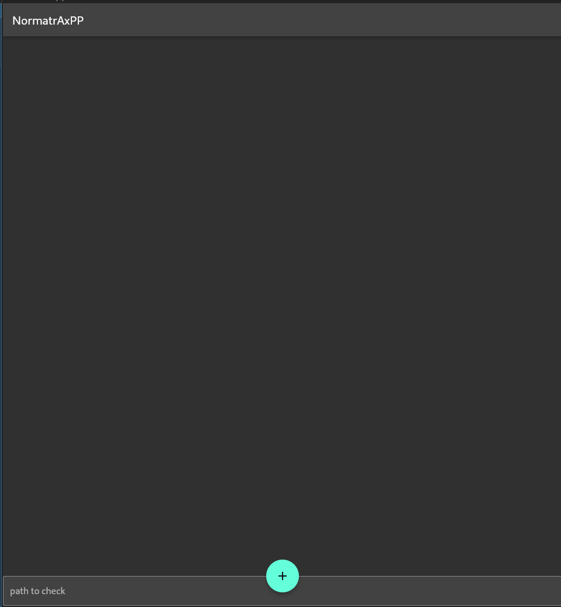
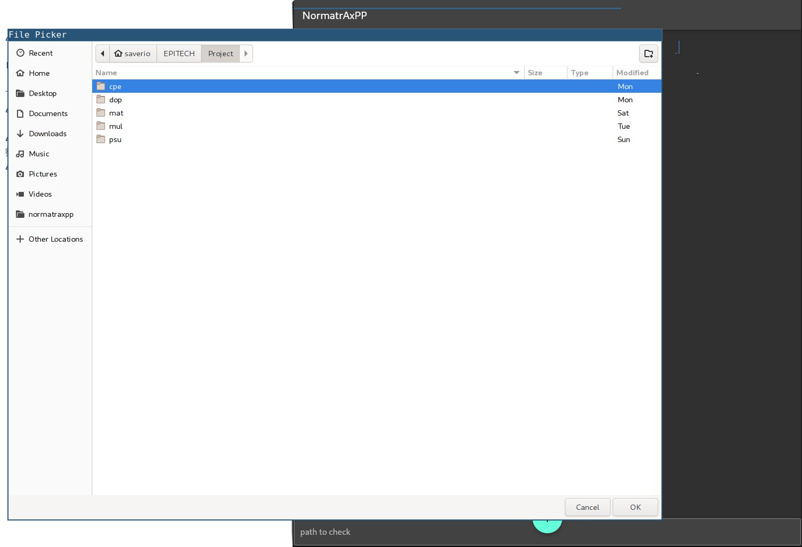
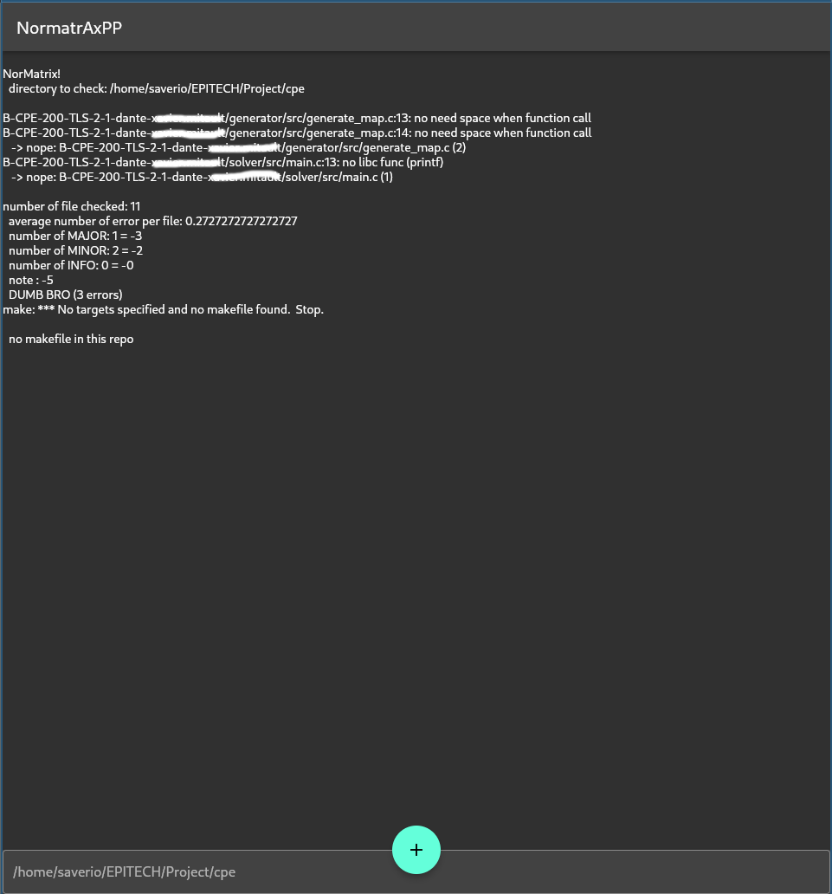

# normatraxpp

try to add a GUI to my epitech c coding style norm checker

it use the normatrix commandline tool
[https://github.com/Saverio976/NorMatrix](https://github.com/Saverio976/NorMatrix)

## Screenshot

